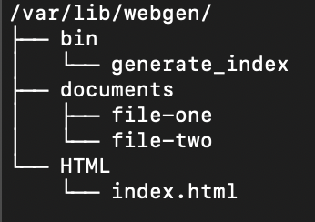
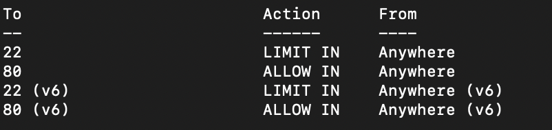
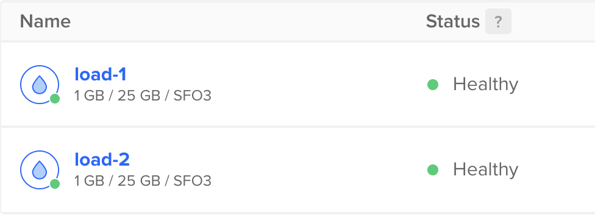
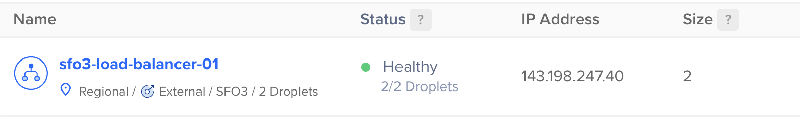
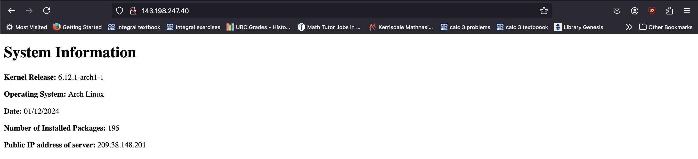
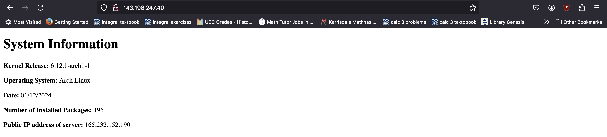
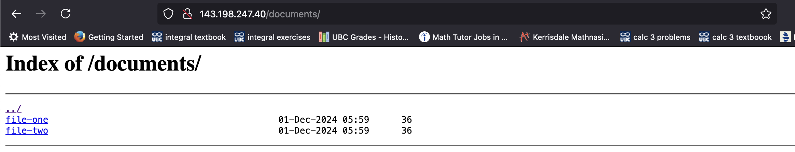

# ACIT-2420-Assignment-3-Part-2
## Table Of Contents
- [Introduction](#introduction)
- [Task 1](#task-1)
- [Task 2](#task-2)
- [Task 3](#task-3)
- [Task 4](#task-4)
- [Task 5](#task-5)
- [References](#references)

## Introduction
These tasks will guide you to create a simple load balancer using the `nginx` web servers that utilizies services, timers and firewalls.

We will be making two droplets and a load balancer on digital ocean before we move on to the tasks.
1. First go to Digital Ocean using your account and create two droplets with the settings that you normally use. In addition add a tag called "web" for both droplets.
2. Now select "Create Load Balancer".
3. Now select the tag for "web" and make sure that the server is the same as your two droplet's servers.
4. Create the load balancer and wait, as it will take a while. Make sure that both of the servers are disconnected as they are not hosting servers yet.
5. Now connect to both droplets and follow the next tasks.

> [!WARNING]
> Make sure you do tasks 1-4 for BOTH droplets.

> [!TIP]
> You can first create all the necessary files on your local machine and then use `sftp` to connect to both droplets and send all the necessary files to them.

## Task 1
First we will have to create a new system user called `webgen`.

To make a system user, run the command, [^1]
```
sudo useradd --system -d /var/lib/webgen -s /usr/bin/nologin webgen
```
Now, create the home directory for the user,
```
sudo mkdir /var/lib/webgen
```
Then go to the home directory of the webgen user.
```
cd /var/lib/webgen
```
> [!TIP]
> Make sure to run sudo before every command from here, or another option is to switch to root and run commands from there.

We will then create a `bin`, `documents` and `HTML` directories using the commands:
```
sudo mkdir bin HTML documents
```
Now we will clone a repository that contains a script that creates an HTML page. Use the command,
```
sudo git clone https://git.sr.ht/~nathan_climbs/2420-as3-p2-start
```
Then, we will move the file from that repository to the `bin` directory.
```
sudo mv 2420-as3-p2-start/generate_index bin
```
And now create an `index.html` page inside the `HTML` by using the command,
```
sudo touch HTML/index.html
```
In addition create a `file-one` and `file-two` file inside the `documents`
```
sudo touch documents/file-one documents/file-two
```
Now edit the two files, with
```
sudo nvim documents/file-one
```
For this file paste the following:
```
This is file one.
```
and for `file-two`, do
```
sudo nvim documents/file-two
```
and paste,
```
This is file two. 
```
You can delete the git repository directory now by running the command,
```
sudo rm -rf 2420-as3-p2-start
```
Now we will need to change the ownership of all the files and directories in the `/var/lib/webgen` home directory to the `webgen` user. 

Run the command, 
```
sudo chown -R webgen /var/lib/webgen
```
In addition, you will have to make the `generate_index` script executable, run
```
sudo chmod +x bin/generate_index
```
From there you can check the permissions by running
```
ls -la $PWD bin HTML
```
You can confirm if you did the steps correctly by running 
```
tree /var/lib/webgen/
``` 
and the output should look the same as the following picture.



## Task 2
We will now create a system service and a timer file that will run the `generate_index` script at 05:00 UTC time.

First we need to make a `generate-index.service` file so run,
```
sudo nvim /etc/systemd/system/generate-index.service
```
And paste the following code. [^2]
```
[Unit]
Description=Run The Generate_Index Script

[Service]
ExecStart=/var/lib/webgen/bin/generate_index
User=webgen
Group=webgen

[Install]
WantedBy=multi-user.target
```
Now create a `generate-index.timer` file, run
```
sudo nvim /etc/systemd/system/generate-index.timer
```
And paste the following code,
```
[Unit]
Description=Run The Generate_Index Script

[Timer]
OnCalendar=*-*-* 05:00:00
Persistent=True

[Install]
WantedBy=timers.target
```
Now we reload all the `systemctd` unit files, run
```
sudo systemctl daemon-reload
```
Then to start the service file run:
```
sudo systemctl start generate-index.service
```
To start and enable the timer run:
```
sudo systemctl enable --now generate-index.timer
```
Lastly, we can check the status of the services, by running the two commands,
```
sudo systemctl status generate-index.service
```
```
sudo systemctl status generate-index.timer
```
- Confirm that the `service` status is enabled and inactive.
- Confirm that the `service` TriggeredBy is `generate-index.timer` and on
- Confirm that the `timer` status is enabled and active.
- Confirm that the `timer` Trigger time is `05:00:00 UTC`.  

You can check if the HTML page isn't empty with HTML code, using
```
sudo cat /var/lib/webgen/HTML/index.html
```
## Task 3
We will now install `nginx` and use it to create our web service that renders the `index.html` that we made previously.

> [!WARNING]
> Ensure that you don't have any other web servers, like apache running, or the following parts will not work! To get rid of them, run `sudo pacman -Rns <web server package>`, then `sudo systemctl reboot` to restart the system, this will kick you out of your droplet and you will have to wait a few minutes till it reboots. From there you can just login normally and do the following steps.

First run
```
sudo pacman -S nginx
```
Now change directories to `nginx`, by
```
cd /etc/nginx
```
Now we will create two directories that will store our server blocks. [^3] 

This allows us to easily enable and disable our server blocks instead of going inside the `nginx.conf` and finding the blocks from there. In addition this allows us to not make many mistakes inside the `nginx.conf` file, which will make troubleshooting easier.

Run the two commands,
```
sudo mkdir sites-available
```
```
sudo mkdir sites-enabled
```
Now we will create a server block file inside of `sites-available`, run
```
sudo touch sites-available/nginx-2420.conf
```
Before we configure any files, go to your Digital Ocean and find the IP address that you are using for the current droplet.

Now we will configure the `nginx-2420.conf` so run
```
sudo nvim sites-available/nginx-2420.conf
```
and paste the following code with the IP address from Digital Ocean:
```
server {
    listen 80;
    listen [::]:80;
    
    server_name <Your IP address on Digital Ocean>;
    
    root /var/lib/webgen/HTML;
    index index.html;

    location /documents {
        root /var/lib/webgen;
        autoindex on;               
        autoindex_exact_size off;   
        autoindex_localtime on;      
    }

	location / {
        try_files $uri $uri/ =404;
    }
}
```
Then we change some parts of the `nginx.conf` file. Run
```
sudo nvim nginx.conf
```
Now change the first line that contains the `user` to the following:
```
user webgen webgen; 
```
This changes the user and group to `webgen` only. 

Then go to the `http` block and append the line, `include sites-enabled/*;` inside of it, like so:
```
http {
    ...
    include sites-enabled/*;
    ...
}
```
Lastly, we have to create a symbolic link from the `sites-enabled/nginx-2420.conf` to `sites-available/nginx-2420.conf`. Run
```
sudo ln -s /etc/nginx/sites-available/nginx-2420.conf /etc/nginx/sites-enabled/nginx-2420.conf
``` 
Now we have to check if there are any errors inside of our `nginx.conf` file, so run
```
sudo nginx -t
```
You should get the messages:
```
nginx: the configuration file /etc/nginx/nginx.conf syntax is ok
nginx: configuration file /etc/nginx/nginx.conf test is successful
```
Now run the `nginx.service` file to get the server running.
```
sudo systemctl enable --now nginx.service
```
We should now check if everything is running properly, run
```
sudo systemctl status nginx.service
```
and make sure that it is enabled and active.

You can now test if the web server works by using your Digital Ocean IP address and pasting that in your web browser and you should get a page that is rendered.

## Task 4
Now we will create a firewall for our web server using `ufw`.

First we have to download the `ufw package`, run 
```
sudo pacman -S ufw
```
Now check the inital status with the following command:

```
sudo ufw status verbose
```
There should be an error. Run the following command to restart your droplet:
```
sudo systemctl reboot
```
You will be kicked out of your droplet and you will have to wait around a minute before it starts again. Once you have waited, log back in and run 
```
sudo ufw status verbose
```
If there is still an error, go to [Task 3's](#task-3) warning and follow the steps.

Then we can allow all `ssh` connections to the server with 
```
sudo ufw allow ssh
```
and rate the limits with the ssh connections with
```
sudo ufw limit ssh
```
Lastly, since we are creating a web server, we have to allow any http requests with 
```
sudo ufw allow http
```
> [!WARNING]
> Before running the following command, ensure that you have ran the `sudo ufw allow ssh` command. If you do not, your droplet will be locked.
Now we have to activate the firewall, run
```
sudo ufw enable
```
Then run the status command again,
```
sudo ufw status verbose
```
and check if your output is similar to the following: 



## Task 5
> [!WARNING]
> Make sure you finished tasks 1-4 for BOTH droplets before continuing on.

Once you have finished configuring both of your droplets so that they are running nginx servers, go to your digital ocean account. Make sure that the load balancer is running now with both servers with a "healthy status".



Now you can go copy your **load balancer** ip-address and paste it on your web browser.



Your page should like the following:


The public IP address of the server should be one of the ip address of one of the droplets that is connected with the load balancer.

Now restart the page a couple times until you see a different public Ip address of the server, like so:


You can go to the `/documents` path like so:

Now you can download each of the files, where `file-one` should contain:
```
This is file one. Testing Download1
```
and `file-two` should contain:
```
This is file two. Testing Download2
```
You have now completed all tasks!

## References

[^1]: https://linux.die.net/man/8/useradd
Linux die.net (n.d.).

[^2]: https://www.digitalocean.com/community/tutorials/understanding-systemd-units-and-unit-files
Digital Ocean (n.d.).

[^3]: https://wiki.archlinux.org/title/Nginx
Arch Wiki 3.2.3.1 (n.d.).